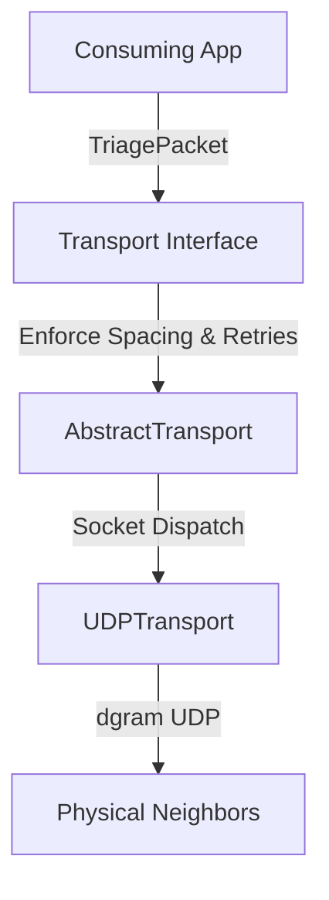

# chowki-lora

This is a simulated LoRa-class transport implemented over UDP while preserving realistic bandwidth, duty cycle, latency, packet loss, acknowledgements, retries, and flooding behaviour. 

It forms the physical and transport layer simulation for the offline-first distributed trekking network **Chowki**, ensuring real-world radio constraints are strictly enforced in local development and testing.

## Architecture

The project decouples business orchestration from socket communication using three distinct layers:



- **[Transport Interface](file:///c:/Users/rajsh/google_deepmind/src/transport.ts)**: Declares the public API for sending, receiving, and stats listening.
- **[AbstractTransport](file:///c:/Users/rajsh/google_deepmind/src/abstractTransport.ts)**: Orchestrates standard simulation constraint logic (transmission queue spacing, exponential backoff retries, duplicate seen checking, and reverse-path ACK routing).
- **[UDPTransport](file:///c:/Users/rajsh/google_deepmind/src/udpTransport.ts)**: Manages low-level bindings using Node's `dgram` library, handling socket initialization, buffer serialization/deserialization, and sending raw envelopes.

## Enforced Physical Constraints

1. **Maximum Payload Size**: Checked against the serialized `Uint8Array` payload size. Exceeding 200 bytes throws a `PayloadTooLargeError`.
2. **Duty Cycle**: A `TransmissionQueue` spaces consecutive packets by at least 1000ms.
3. **Random Hop Latency**: Every transmission is delayed by a random offset between 300ms and 800ms using an injected `RandomProvider`.
4. **Link Packet Loss**: Dropped randomly based on the `LORA_LOSS` config setting (defaults to `0.1` / 10%).
5. **Reliability & SOS Retries**: Employs exponential backoff retries. Normal/Warning urgency retries 3 times (4 attempts total), while SOS urgency retries 6 times (7 attempts total).
6. **Multi-Hop Flooding Relay**: Relays packets whose target ID does not match the node ID. Reduces TTL and records visit history via `hopPassport` list.
7. **Unicast ACKs**: Direct end-to-end ACKs route back to the original sender using the reverse path tracking map, bypassing flooding.

## Public API

```typescript
import { UDPTransport, ConfigLoader, MockRandomProvider } from 'chowki-lora';

// Load config
const config = new ConfigLoader().getConfig();
const rand = new MockRandomProvider(); // Or your production RandomProvider

// Instantiation
const transport = new UDPTransport(config, rand);
await transport.start();

// Listeners
transport.onReceive((packet) => {
  console.log(`Received packet: ${packet.packetId}`);
});

transport.onStats((stats) => {
  console.log(`Telemetry updated: ${JSON.stringify(stats)}`);
});

// Transmit Triage Packet
const report = await transport.sendTriage({
  packetId: "pkt-100",
  src: "cp1",
  dst: "cp3",
  ttl: 5,
  urgency: "sos",
  payload: new Uint8Array([0x01, 0x02]),
  hopPassport: [],
  createdAt: Date.now()
}, "cp3");

console.log(`Delivered? ${report.delivered} in ${report.attempts} attempts.`);

// Shutdown
await transport.close();
```

## Configuration

Nodes expect a `chowki.config.json` in the working directory:

```json
{
  "id": "cp2",
  "port": 4002,
  "peers": [
    {
      "id": "cp1",
      "host": "127.0.0.1",
      "port": 4001
    },
    {
      "id": "cp3",
      "host": "127.0.0.1",
      "port": 4003
    }
  ]
}
```

## Setup & Testing

### Installation

Install dependencies:

```bash
npm install
```

### Running Tests

Run the Vitest suite:

```bash
npm test
```

## Known Limitations

- **Loopback Bound**: Designed for local localhost testing; nodes bind on `127.0.0.1` ports.
- **In-Memory De-duplication**: `seenPackets` set grows in-memory over the process lifetime.
